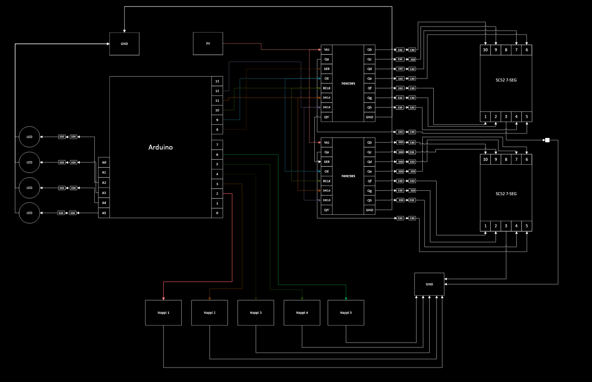

# TVT25KMO_r9_sovellusprojekti

**Arduino UNO:lla toteutettu "Speden Spelit" -tyylinen nopeustestipeli**  

## Kuvaus
Tämä projekti on osa **Oulun ammattikorkeakoulun sovellusprojekti-opintojaksoa**.  
Pelin tarkoituksena on testata pelaajan reaktionopeutta Arduinon ohjaamien painikkeiden ja LEDien avulla.

## Tekijät
- Joni Pylkkönen
- Jesse Vaarala
- Onni Flink
- Miikka Haapea

Projektissa käytetyt komponentit:
---

```
1x Arduino Uno
2x 74HC595 Siirtorekisteriä
2x SC52 7 segmenttistä näyttöä
5x painiketta
4x 3.3V LEDejä
```

Kytkentä kaavio
-----

